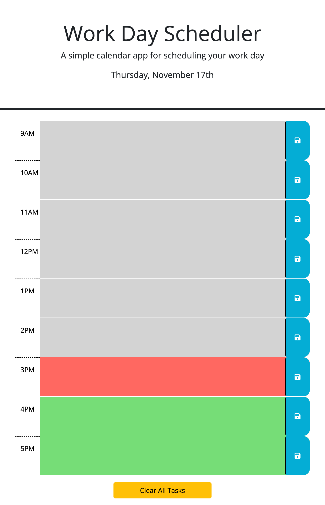

# work-day-scheduler

## Description

This project was created to help the user schedule their day for each hour
of a 9-5 work day. The user can save events and clear all their events
when finished with the day. The current day is also included in the top.

Each time block is color coded, past is gray, present is red, and future is green. 

## Usage 

[Deployed URL](https://hope428.github.io/work-day-scheduler/)  
[Github Repo](https://github.com/hope428/work-day-scheduler)

## Credits

This project uses Bootstrap and the DayJS library
